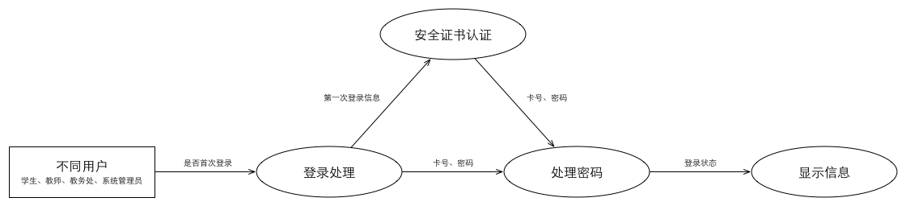
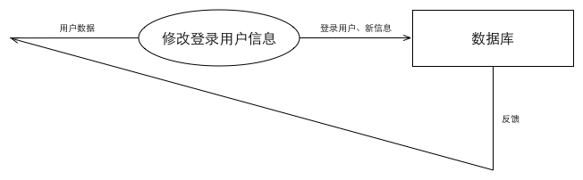
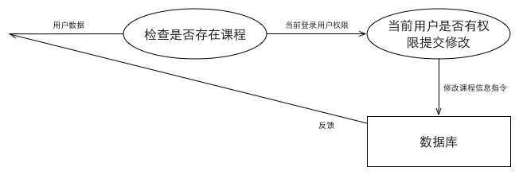

# 教学服务系统
### 信息管理子系统
__需求说明书__
__2015年4月18日__

       
       
       
   

组长：董可扬  
组员：安磊，秦昇，徐雨豪，王儒  

- - -

# 目录

[TOC]

- - -

## 1. 引言
 

### 1.1 编写目的
本需求说明书的编写目的，主要在于规范教务管理系统信息管理子系统的编写。  

它说明了本子系统的各项功能和性能需求，明确标识各功能的实现过程，阐述实用范围及背景，提供 客户解决问题或达到目标所需的条件或权能，提供一个度量和遵循的基准。  

另一方面，本说明书也是为了提高软件开发过程中的能见度，便于对软件开发过程中的控 制与管理，同时也便于程序员和客户之间的交流、协作，并可以作为工作成果的原始依据保存 下来。它是用户和开发者对软件初始规定的共同理解，是整个开发工作的基础，它对本子系统 的功能、性能、用户界面及运行环境等作出详细的描述，以便于系统的进一步开发工作。  

目的在于:  

1. 作为信息管理子系统开发内容及其约束的参考依据，为开发方与客户方提供参考。  
2. 根据信息管理子系统的工作特点和工作流程，为系统开发者进行设计和编程提供基础。  
3. 提供测试和验收的依据，即为选取测试用例和进行验收的依据。  

本说明书的预期读者包括：  

1. 软件客户  
2. 项目经理  
3. 项目开发人员  
4. 软件质量分析员  
5. 软件维护人员  

### 1.2 背景

1. 软件系统名称  
  __教务管理系统__

2. 任务提出者  
  __浙江大学软件工程基础课程任课老师 陈越__

3. 开发者	
  __浙江大学2014-2015学年春夏学期软件工程基础课程部分学生组成的项目组__

4. 用户  
  __学生、老师、学校管理者、系统管理员、验收员(由于此软件是作为课程实践而布置的作业，我们将其假定为浙江大学软件工程基础课程助教)。__  

5. 实现该软件的计算机网络	
	__由若干台机组成的局域网__  

6. 该软件系统同其他系统或其他机构的基本的相互来往关系  
    - 该子系统为自动排课子系统提供教师基本信息、课程基本信息  
    - 该子系统为选课子系统提供教师基本信息、课程基本信息、学生基本信息  
    - 该子系统为课程资源共享子系统提供课程基本信息  
    - 该子系统为课程论坛子系统提供教师基本信息、课程基本信息、学生基本信息  
    - 该子系统为在线测试子系统提供教师基本信息、课程基本信息、学生基本信息  
    - 该子系统为分数管理子系统提供教师基本信息、学生基本信息  
    - 该子系统为所有子系统提供使用者权限说明以及系统安全保障  

7. 相关背景介绍	
  __为全面提高学生创新和实践能力，浙江大学软件工程基础课程分为课堂教学和综合性实 验两部分。综合性实验采取分组形式完成，每 个学生为 组，分别设有组长、主程 序员、程序员、测试员、文档员等角色，全面锻炼学生的系统设计与实现能力、测试能 力、组织文档能力、以及团队合作能力。综合性实验从实际问题中抽取，贯穿全部重要知 识点，通过 个步骤的阶段性验收，锻炼学生综合运用每个环节所学知识解决实际问题 的能力。本次课程，教师选取教务管理系统作为综合性实验题目。__  

###1.3 定义

###1.4 参考资料

## 2. 任务概述
 

###2.1 目标
基础信息管理子系统，实现包含用户基本信息管理、课程基本信息管理、用户权限管理、 系统安全管理这四大基本功能在内的一系列功能。
用户基本信息管理:包括用户的账号、登陆密码、用户年级或所属单位、手机号、邮箱等 基本信息。

课程基本信息管理:包括课程号、课程名、面向对象、不同老师的开班情况、已选人数等 基本信息。

用户权限管理:不同类型用户拥有不同的权限，系统管理员拥有最高权限。学生的有限权 限包括修改个人信息、选课退课等；一般老师的有限权限包括修改个人信息、输入学生分数等； 学校管理者的有限权限包括增加删除课程、修改开课老师信息与选课学生信息等；系统管理员 具有所有权限，能够决定赋予其他用户什么权限。
系统安全管理:记录系统的每次重要更改信息，定期对系统进行检测与维护，确保系统的安全性。

###2.2 用户的特点
用户分四大类：

1. 学生  
	__学生是教育系统的主体用户。学生群体对于系统的使用能够较快入门并熟悉，他们频繁使用此系统进行课程查询与成绩查询。应保障系统能够持续运作并接受高频率的使用。__  

2. 一般老师  
	__一般老师相对较少使用此系统，在开学前与期末阶段使用此系统的频率较高。因一些老师对于新系统的接受程度较低，该系统对于学院老师的界面应尽量直观、易懂，操作应尽量简单、容易上手、易于操作，性能应尽量实时、准确。__  
	
3. 学校管理者  
	__学校管理者使用此系统的频率比一般老师高，相对学生较低。一般在选课阶段以及期末阶段使用此系统的频率较高。平时为了查阅教学班信息也会使用此系统。因一些管理者 对于新系统的接受程度较低，该系统对于管理者的界面应尽量直观、易懂，操作应尽量简单、容易上手、易于操作，性能应尽量实时、准确。__  

4. 系统管理员  
	__系统管理员熟知系统的运作规律，对系统进行定期检测与维护，拥有最高权限。在尽可能给予管理员更多权限的同时要设立一定约束条件，以免错误操作带来损失。__  

###2.3 假定和约束
本次软件开发出于实验性目的，暂无经费划拨，希望项目开发团队能够充分利用现有资源高效地开发出符合需求的系统。  

教学服务系统由6个子系统构成，每个子系统完成其中一项功能，最后进行系统集成。此项目开发期限较短，因此各个子系统务必要安排好工作进度，保证有一定的时间进行系统集成。基础信息管理子系统与其它几个子系统均有关联，因此，务必要做好与其它几个子系统开发团队的沟通协商工作。  

此次软件开发本着实验教学的目的，同时访问本系统的客户端较少，故对数据处理能力等 方面要求不高。  
 

## 3. 用户场景
 

### 3.1 用例表
#### 表1用例 - 用户登录
| 用例 | 用户登录 |
|------|----------|
| 主要参与者 | 学生 |
| 目标 | 登录 |
| 前提条件 | 计算机成功连上因特网 |
| 触发器 | 用户决定登录客户端 |
| 场景 | 1. 用户打开浏览器  2. 用户输入网址  3. 用户得到登录界面  4. 用户输入账号和密码  5. 用户输入验证码  6. 用户按下“登录”选项  7. 用户成功登录， 得到客户端主界面  |
| 异常 | 1. 网址无法打开  2. 账号错误（含非法字符、格式不对、数据库中无此账号）  3. 账号过短  4. 账号过长  5. 密码过短  6. 密码过长  7. 密码错误（与数据库中数据不一致）  8. 按下“登录”后页面无反应  |
| 优先级 | 比如某一阶段只对某些用户开放使用等功能 |
| 何时可用 | 服务器开启状态 |
| 使用频率 | 频繁 |
| 次要参与者 | 一般老师、学校管理者与系统管理员 |
| 次要参与者使用方式 | 通过浏览器 |
| 使用方式 | 通过浏览器、本地数据库 |
| 未解决的问题 | 1. 如何在用户首次登录客户端时进行安全证书的认证？  2. 如何防止暴力破解？  3. 如何设置密码取回机制？  |

#### 表2用例 — 查询登陆用户的信息
| 用例 | 查询登陆用户的信息 |
|------|--------------------|
| 主要参与者 | 学生 |
| 目标 | 查询登用户的信息（包括个人资料与选课情况等） |
| 前提条件 | 用户已成功登录 |
| 触发器 | 用户决定查询与自己相关的信息 |
| 场景 | 1. 用户选择界面上的信息查询功能  2. 服务器响应，用户得到自己的信息  |
| 异常 | 1. 选择信息查询功能后浏览器毫无反应  2. 浏览器弹出一个错误页面（如Page not found）  |
| 优先级 | 暂无 |
| 何时可用 | 服务器开启状态 |
| 使用频率 | 频繁 |
| 使用方式 | 通过浏览器 |
| 次要参与者 | 一般老师、学校管理者与系统管理员 |
| 次要参与者使用方式 | 通过浏览器 |
| 使用方式 | 通过浏览器、本地数据库 |
| 未解决的问题 | 如何使信息排版合理、易理解？|

#### 表3用例 — 修改登陆用户的信息
| 用例 | 修改登陆用户的信息 |
|------|--------------------|
| 主要参与者 | 学生 |
| 目标 | 修改登陆用户的信息（包括个人资料、选课退课等） |
| 前提条件 | 用户已成功登录 |
| 触发器| 用户决定修改自己的信息 |
| 场景 | 1. 用户选择界面上的信息修改功能  2. 服务器响应， 用户得到自己的信息  3. 用户修改信息  |
| 异常 | 1. 选择信息查询功能后浏览器毫无反应  2. 浏览器弹出一个错误页面（如Page not found）  |
| 优先级 | 比如某一阶段用户只能修改特定资料 |
| 何时可用 | 服务器开启状态 |
| 使用频率 | 一般 |
| 使用方式 | 通过浏览器 |
| 次要参与者 | 一般老师、学校管理者与系统管理员 |
| 次要参与者使用方式 | 通过浏览器 |
| 使用方式 | 通过浏览器、本地数据库 |
| 未解决的问题 | 如何将某些修改设为重大修改事项并将此修改记录并报告给优先级较高的用户？|

#### 表4用例 — 修改密码
| 用例 | 修改密码 |
|------|----------|
| 主要参与者 | 学生 |
| 目标 | 用户修改密码 |
| 前提条件 | 用户已成功登录 |
| 触发器 | 用户决定修改密码 |
| 场景 | 1. 用户输入原有密码  2. 系统核实用户输入是否正确  3. 用户输入新密码  4. 用户核实输入新密码  5. 系统返回执行结果 （成功/失败）  |
| 异常 | 1. 用户输入原有密码错误  2. 用户输入原有密码错误次数超过限制 （5 次）  3. 新密码长度过短  4. 新密码长度过长  5. 新密码包含？法字符  6. 用户前后两次密码输入不一致  7. 用户前后两次密码输入不一致次数超过限制（5 次）  |
| 优先级 | 比如某一阶段用户只能修改特定资料 |
| 何时可用 | 服务器开启状态 |
| 使用频率 | 一般 |
| 使用方式 | 通过浏览器 |
| 次要参与者 | 一般老师？学校管理者与系统管理员 |
| 次要参与者使用方式 | 通过浏览器 |
| 使用方式 | 通过浏览器、本地数据库 |
| 未解决的问题 | 1. 系统是否支持比较简单常见的密码？  2. 系统如何防止暴力破解？  |

#### 表5用例 — 课程信息管理
| 用例 | 课程信息管理 |
|------|--------------|
| 主要参与者 | 学校管理者 |
| 目标 | 课程信息的添加、修改、删除 |
| 前提条件 | 用户已成功登录 |
| 触发器| 用户决定改变课程信息 |
| 场景 | 1. 用户选择界面上的课程信息修改功能  2. 服务器响应， 用户得到相应的信息  3. 用户修改信息  |
| 异常 | 1. 选择信息查询功能后浏览器毫无反应  2. 浏览器弹出一个错误页面（如Page not found）  |
| 优先级 | 暂无 |
| 何时可用 | 服务器开启状态 |
| 使用频率 | 一般 |
| 使用方式 | 通过浏览器 |
| 次要参与者 | 一般老师、学校管理者与系统管理员 |
| 次要参与者使用方式 | 通过浏览器修改课程描述信息 |
| 使用方式 | 通过浏览器、本地数据库 |
| 未解决的问题 | 如何规范学校管理者的使用权利？ |

#### 表6用例 — 学生、教师信息管理
| 用例 | 学生、教师信息管理 |
|------|--------------------|
| 主要参与者 | 学校管理者 |
| 目标 | 学生、教师信息的添加、修改、删除 |
| 前提条件 | 用户已成功登录 |
| 触发器 | 用户决定改变课程信息 |
| 场景 | 1. 管理者选择界面上的用户信息修改功能  2. 服务器响应， 管理者得到相应的信息  3. 管理者修改信息  |
| 异常 | 1. 选择信息查询功能后浏览器毫无反应  2. 浏览器弹出一个错误页面（如Page not found）  |
| 优先级 | 暂无 |
| 何时可用 | 服务器开启状态 |
| 使用频率 | 一般 |
| 使用方式 | 通过浏览器 |
| 次要参与者 | 暂无 |
| 次要参与者使用方式 | 暂无 |
| 使用方式 | 通过浏览器、本地数据库 |
| 未解决的问题 | 暂无 |

#### 表7用例 — 权限管理
| 用例 | 权限管理 |
|------|----------|
| 主要参与者 | 学校管理者与系统管理员 |
| 目标 | 优先级低于参与者的用户 |
| 前提条件 | 用户已成功登录 |
| 触发器 | 用户决定修改优先级较低用户的权限 |
| 场景 | 1. 用户选择界面上的权限修改功能  2. 服务器响应， 用户得到相应的信息  3. 用户修改信息  |
| 异常 | 1. 选择信息查询功能后浏览器毫无反应  2. 浏览器弹出一个错误页面（如Page not found）  |
| 优先级 | 系统管理员最高、学校管理者第二、一般老师第三、学生最低 |
| 何时可用 | 服务器开启状态 |
| 使用频率 | 较低 |
| 使用方式 | 通过浏览器 |
| 次要参与者 | 一般老师与学生 |
| 次要参与者使用方式 | 通过浏览器修改优先级较低用户的权限 |
| 使用方式 | 通过浏览器、本地数据库 |
| 未解决的问题 | 上级如何对下级进行授权与取消授权 |

### 3.2 IPO图
以下IPO图表示用户数据输入和系统数据输出的流程和关系。本系统的逻辑具有一定复杂性，因此图示是一种较好的表示方式。

## 4. 数据流图
 

以下给出与本子系统有关的数据流图。

### 4.1 环境层数据流图

### 4.2 第一层数据流图

### 4.3 第二层数据流图
#### 4.3.1 登录处理

#### 4.3.2 修改登录用户信息

#### 4.3.3 修改密码

#### 4.3.4 课程信息管理

#### 4.3.5 权限管理

## 5. 状态图
 

## 6. CRC卡
 

### 类：login
__说明__：当用户登陆时记录用户信息并进行验证

| 职责 | 协作者 |
|------|--------|
| 记录id ||
| 记录密码 ||
| 身份验证 | User |
| 验证失败时，请用户重新输入 ||
| 验证成功时，显示主界面 ||
| 验证失败次数超过限制时，拒绝登录尝试 ||

### 类：user
__说明__：存储用户信息

| 职责 | 协作者 |
|------|--------|
| 存储id ||
| 存储密码 ||
| 存储身份类别 ||
| 存储用户联系方式 ||
| 存储用户院系 ||

### 类：right
__说明__：存储用户身份类别和权限

| 职责 | 协作者 |
|------|--------|
| 存储用户类别所对应的权限 ||

### 类：course
__说明__：

1. 存储课程信息  
2. 与自动排课子系统进行交互  
3. 发送课程信息至自动排课子系统  
4. 接受来自排课系统的课程信息  

| 职责 | 协作者 |
|------|--------|
| 存储课程 ||
| 存储课程名称 ||
| 存储预修要求 ||
| 存储任课教师 ||
| 存储上课时间 ||
| 存储上课教室 ||
| 存储考试时间 ||
| 存储上课教室 ||

### 类：query_user
__说明__：当用户需要查询用户信息时提交请求并显示结果

| 职责 | 协作者 |
|------|--------|
| 记录使用者的 ||
| 查看个人信息 ||
| 检查当前用户权限 | User Right |
| 查看他人信息 | User |
| 记录需要查询的关键字 ||
| 记录查询关键字类别 ||
| 提交查询请求  User |
| 查询结果为空时提醒用户找不到 ||
| 显示查询结果 ||
| 显示结果的id ||
| 显示结果的姓名 ||
| 显示结果的类别 ||
| 显示结果的联系方式 ||
| 显示结果的院系 ||

### 类：add_user
__说明__：当有权限用户需要增加一个用户时请求并显示结果

| 职责 | 协作者 |
|------|--------|
| 记录使用者的id ||
| 查看个人信息 ||
| 检查当前用户权限 | Right |
| 权限不够则提示没有权限 ||
| 检查用户 是否重复 | User |
| 重复则提示用户更换 ||
| 记录用户姓名 | User |
| 记录用户联系方式 ||
| 记录用户院系 ||
| 提交增加用户请求 | User |
| 返回执行状态(成功失败) ||

### 类：delete_user
__说明__：当有权限用户需要删除一个用户时请求并显示结果

| 职责 | 协作者 |
|------|--------|
| 记录使用者的id ||
| 检查当前用户权限  Right |
| 权限不够则提示没有权限 ||
| 记录删除的用户id ||
| 检查用户id是否存在 | User |
| 不存在则提示用户重新输入 ||
| 提交删除请求 | User |
| 返回执行状态(成功失败) ||

### 类：update_user
__说明__：当用户需要修改用户信息时提交请求并显示结果

| 职责 | 协作者 |
|------|--------|
| 记录使用者的id ||
| 检查用户id | User |
| 记录用户姓名 ||
| 记录用户联系方式 ||
| 记录用户院系 ||
| 提交修改请求 | User |
| 返回执行状态(成功失败) ||

### 类：query_course
__说明__：当用户需要查询课程信息时提交请求并显示结果

| 职责 | 协作者 |
|------|--------|
| 记录查询关键字 ||
| 记录关键字类别 ||
| 提交查询请求 | Course |
| 查询结果为空时提醒用户找不到 ||
| 显示结果的id | User |
| 显示结果的课程名 ||
| 显示结果的预修要求 ||
| 显示结果的任课教师 ||
| 显示结果的上课时间 ||
| 显示结果的上课教室 ||
| 返回执行状态(成功失败) ||

### 类：add_course
__说明__：当有权限用户需要增加一个课程时请求并显示结果

| 职责 | 协作者 |
|------|--------|
| 记录当前用户id ||
| 检查当前用户权限 | User Right |
| 权限不够则提示没有权限 ||
| 记录增加的课程 ||
| 检查课程id是否重复 | Course |
| 重复则提示用户更换 ||
| 记录课程名 | User |
| 记录预修要求 ||
| 记录任何教师 ||
| 提交增加课程请求 | Course |
| 返回执行状态(成功失败) ||

### 类：update_course
__说明__：当用户需要修改课程信息时提交请求并显示结果

| 职责 | 协作者 |
|------|--------|
| 记录课程id ||
| 检查课程id | Course |
| 记录当前用户id ||
| 检查当前用户权限 | Right |
| 权限不够时提醒用户无法修改 ||
| 记录课程名 ||
| 记录预修要求 ||
| 记录任课教师 ||
| 发出修改指令| Course |
| 返回执行状态(成功失败) ||

### 类：right_manage
__说明__：增加、删除、修改用户类别，只有管理员可以操作

| 职责 | 协作者 |
|------|--------|
| 检查用户类别是否为管理员 | Right |
| 不是管理员则返回请求前状态 ||
| 增加类别 ||
| 删除类别 ||
| 修改类别 ||
| 记录类别名 ||
| 记录权限 ||
| 执行操作请求 | Right |
| 返回执行状态(成功失败) ||

## 7. 数据词典
 

### 7.1 数据流定义表
| 编号 | 数据流名 | 来源 | 去向 | 说明 |
|------|----------|------|------|------|
| 1.1 | 学生用户指令 | 学生用户 | 教学管理系统 | 包括学生用户发出的登陆指令，成绩查询指令，课程信息查询指令，教室查询指令等等 |
| 1.2 | 学生指令执行结果 | 教学服务系统 | 学生用户 | 教务系统呈现给用户的数据 |
| 1.3 | 教师用户指令 | 教师用户 | 教学管理系统 | 包括教师用户发出的登陆指令，课程查询指令，教室查询指令，学生成绩录入信息等等 |
| 1.4 | 教师指令执行结果 | 教学服务系统 | 教师用户 | 教务系统呈现给用户的数据 |
| 1.5 | 管理员用户指令 | 管理员用户 | 教学管理系统 | 包括管理员用户发出的修改学生选课信息，成绩信息等指令 |
| 1.6 | 管理员指令执行结果 | 教学服务系统 | 管理员用户 | 教务系统呈现给用户的数据 |

### 7.2 数据元素定义表
| 编号 | 数据元素名 | 类型 |
|------|------------|------|
| E1 | 学生学号 | 字符 |
| E2 | 教师职工号 | 字符 |
| E3 | 密码 | 字符 |
| E4 | 学生成绩 | 数字 |
| E5 | 课程名字 | 字符 |
| E6 | 课程容量 | 数字 |
| E7 | 教室信息 | 字符 |
| E8 | 课表信息 | 字符 |
| E9 | 管理员账号 | 字符 |

### 7.3 外部项定义表
| 编号 | 外部项名 | 输入数据流 | 输出数据流 | 说明 |
|------|----------|------------|------------|------|
| W1 | 用户 | 用户指令 | 指令执行结果 | 用户进行操作，得到相应 | 结果 |
| W2 | 选课子系统 | 用户选课信息 | 用户课表 | 用户进行选课，在信息子 | 系统中进行记录 |
| W3 | 自动课程安排 | 子系统 | 用户预置课表 | 在学生选课前进行课表 | 预置 |
| W4 | 评分系统 | 教师用户输入 | 学生成绩 | 学生对应课程 | 成绩 |

### 7.4 数据精度表
| 数据 | 类型 | 精度要求 | 说明 | 示例 |
|------|------|----------|------|------|
| 学生学号 | 字符 | 整数 | 10位 | 3120100001 |
| 教师职工号 | 字符 | 整数 | 6位 | 000000 |
| 密码 | 字符 | 6-15位 | 须含大小写字母和数字 | Hello123 |
| 学生成绩 | 数字 | 整数 | 0-100 | 99 |
| 课程名字 | 字符 | 最多110位汉字或英文字母 || 软件工程基础 |
| 教室信息 | 字符 | 汉字，英文字母，数字组合 || 曹西-103 |

## 8. 验收标准
 

### 8.1 功能需求
信息管理子系统中包括各类用户信息，课程信息，用户权限，以及提供整套系统相应的安全服务。  
各类用户信息和课程信息包括：  

1. 学生用户的信息内容包括：个人用户信息，课程表，成绩信息，任课教师信息，上课教室信息等等。用户可以登录教务系统查看个人所有信息，并且进行选课等操作。  
2. 教师用户的信息内容包括：个人用户信息，课程表，学生成绩信息，上课教室信息等等。教师登录管理系统后也可以进行所教授课程学生成绩录入操作。  
3. 教务处管理员用户的信息内容包括：个人用户信息，整个教务管理系统中的所有信息。管理员登录之后可以进行学生成绩修改，选课修改等操作。  
4. 后台管理员的信息包括整个教务管理系统的所有信息以及教务处管理员的所有信息。后台管理员可以进行整个教务管理系统的任意信息改动以及维护。  
5. 课程信息包括课程名字，课程分数，课程容量，课程评估等等信息。  

各类用户权限包括：  
1. 教务处管理员可以增加，删除，修改，查询所有教师和学生的信息。  
2. 学生和教师可以修改填充个人信息，上传照片等等。  

### 8.2 性能需求
对于教务信息管理系统而言，信息查询速度一定要快并且准确。并且在选课阶段有可能产生多用户同时登陆教务管理系统的情况。我们提出以下要求：  

- 后台数据库设计简洁直观，方便前端数据录入和后端数据输出。  
- 系统具有良好的反应速度，给用户良好的反应体验。我们要求在良好的网络情况下，系统应具有以下时间特性要求：  
    - 单个用户在线时：教务系统响应用户动作时间应当小于0.5秒。  
    - 上百个用户同时在线时，教务系统响应用户动作时间小于2秒。  

### 8.3 安全性需求
1. 保密性  
  认证：通过用户名，密码认证。防止非法用户进入系统。其中，客户端首次登录时，还要保证安全证书的认证。  
2. 完整性  
  防止非法用户对进行交换的数据进无意或恶意的修改，插入，防止交换的数据丢失。  
3. 用户信息安全性
  系统应着重用户信息安全性设计，做到外界人员无法非法入侵到系统本身，内部人员操作则留下操作痕迹和日志，使用权管理层可以定期或者不定期的核查系统。  
