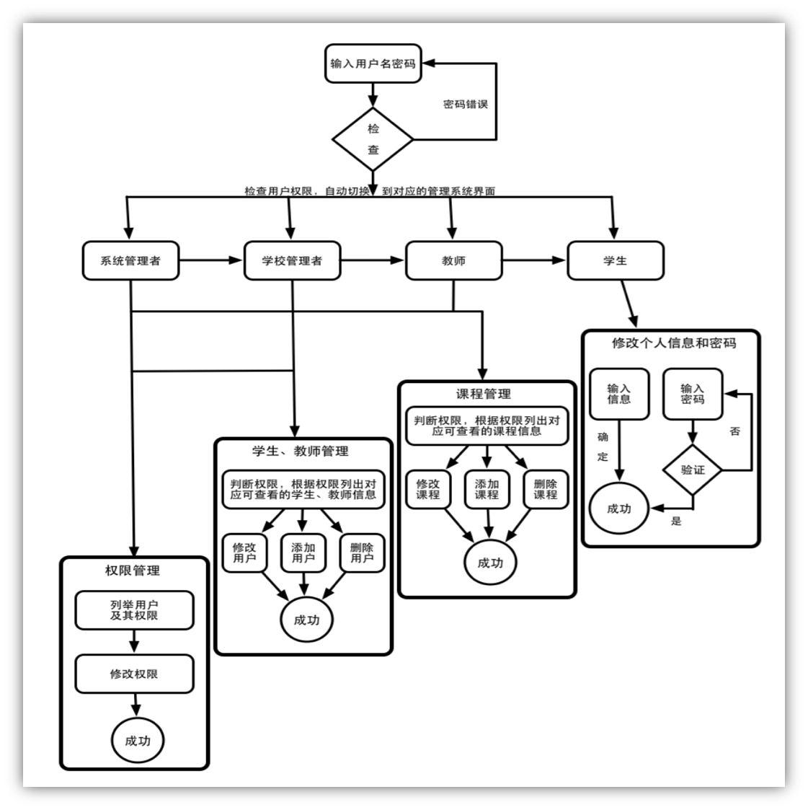

# Info-Manage-System

# 信息管理子系统内部说明
## Django Systerm
###1. Django Admin
访问`http://localhost:8000/admin`即可用GUI的方式管理用户组和权限组，superuser账户名和密码默认是IMS/ims（我设的），可以在后台用命令添加。（有可能是ims/ims。。。）

###2. 数据库接口 models.py
Django将数据库I/O抽象为模型（MTV），要调用IMS子系统抽象的一系列基础信息数据库表，`import djcode.IMS.models`即可。

###3. csrf
在使用post或者get请求的Templates或者JS脚本中务必注意csrf中间件的限制，增加``，如`https://github.com/LL-SE-BLACK/IMS1/blob/master/djcode/IMS/templates/login.html`;

Ajax请求时对于csrf的使用请见示例：`https://github.com/LL-SE-BLACK/IMS1/blob/master/djcode/IMS/templates/add_user.html`

###4. user类
用户登录、权限检查和admin组用户的信息管理全部交给Django自带的user类。在进入每个子模块的每个功能模块时，虽然已经使用了csrf中间件防止跨域url伪造攻击，都仍要检查用户登录与否、是否拥有相应权限。

## 数据流基本说明


- 暂时不做撤销指令和权限管理

##子系统内部功能权限图




## 数据库表头

**SQLite3 Data Type Reference:**

`http://www.w3cschool.cc/sqlite/sqlite-data-types.html`

### 1. login_info

| id | password | logintype |
|---|---|---|
| VARCHAR(10) | VARCHAR(32) | VARCHAR(10) |

### 2. student_users

| id | contact | name | gender | college | major | grade | gpa | credits |
|---|---|---|---|---|---|---|---|---|
| CHARACTER(10) | VARCHAR(11) | VARCHAR(20) | BOOLEAN | VARCHAR(50) | VARCHAR(50) | INTEGER | FLOAT | FLOAT |

- `college`: 学院

### 3. faculty_users

| id | contact | name | gender | college | major | degree | title |
|---|---|---|---|---|---|---|---|
| CHARACTER(6) | VARCHAR(11) | VARCHAR(20) | BOOLEAN | VARCHAR(50) | VARCHAR(50) | VARCHAR(20) | VARCHAR(20) |

- `degree`: 行政级别（chairman, lead researcher, etc.）
- `title`: 学术头衔（Professor, Assistant Prof., etc.）

### *4. admin_users （暂时没有这张表）

| id | contact | name | gender | right |
|---|---|---|---|---|
| CHARACTER(3) | VARCHAR(11) | VARCHAR(20) | BOOLEAN | INTEGER |

- `right`: 记录root赋予给各管理员用户的、各项不同的信息记录操作的权限（类似于Linux中`777`……）
- 目前用Django自带的User类做登录和权限组管理

### 5. course_info

| course_id | name | credits | semester | textbook | college |
|---|---|---|---|---|---|
| CHARACTER(10) | CHARACTER(8) | VARCHAR(110) | FLOAT | INTEGER | VARCHAR(110) | VARCHAR(50) |

- `semester`: 0 for fall, 1 for winter, 2 for spring, 3 for summer, 4 for short, 5 for fall-winter, 6 for spring-summer
- `college`: 开课学院

### 6. class_info

| class_id | course_id | teacher | time | room | examdate | examtime | examroom | capacity |
|---|---|---|---|---|---|---|---|---|
| CHARACTER(10) | CHARACTER(8) | VARCHAR(20) | INTEGER | VARCHAR(20) | DATETIME(TEXT) | INTEGER | VARCHAR(20) | INTEGER |

- 教学班信息
- `examdate`: 考试日期
- `examtime`: 一天排4个考试时段的话，分别是[0-3]
- `capacity`: 教学班选课容量

### 7. pre_requisites

| course_id | prereq |
|---|---|
| CHARACTER(8) | CHARACTER(8) |

- 课程预修要求

### 8. class_table

| student_id | class_id |
|---|---|
| CHARACTER(10) | CHARACTER(10) |

- 学生课程（选课）表，即学生id和教学班id的一对多映射关系

### 9. scores

- 学生成绩表，包括平时成绩、总成绩等；
- 建议和选课表做成同一张，由成绩管理组设计后，存放于此（如有其他建议，请尽快和本组联系）


以下内容如与上述有冲突，以上述为准（有些还来不及细改orz）
----


## 数据元素&精度基本说明

|    数据名   |        类型定义       |   字节   |                说明              |                示例              |
| ----------- | --------------------- | --------:| -------------------------------- | --------------------------------:|
| name        | varchar(20)           | 20       | 姓名，最多20个字母或10个汉字组成 | 董可扬                           |
| student_id  | char(10)              | 10       | 学生学号，由十位数字组成         | 3120102084                       |
| teacher_id  | char(6)               | 6        | 教职工工号，由6位数字组成        | 123456                           |
| contact     | char(11)              | 11       | 联系方式，由11位数字组成的手机号 | 18868107127                      |
| password    | char(32)              | 32       | md5校验产生的密文32位字符串密文  | 1055d3e698d289f2af8663725127bd4b |
| grade       | integer(1897, 9999)   | 4        | 年级，用入学年份表示             | 2012                             |
| score       | integer(0, 100)       | 4        | 学生课程得分                     | 95                               |
| credit      | integer(0, INFINITY)  | 4        | 课程学分或学生获得学分           | 4.5                              |
| course_name | varchar(110)          | [0, 110] | 课程名称，由汉字、字母和数字组成 | 软件工程                         |
| course_id   | char(8)               | 8        | 课程编号，由8个字母或数字组成    | 21120261                         |
| classroom   | varchar(50)           | [0, 50]  | 教室名称，由建筑名称和门牌号构成 | 曹光彪二期101                    |

## CRC说明
### 登录
#### Class

```java
class Login {
  private char[]    id;
  private char[]    password;  // char[32] for md5 password
  private LoginType type;      // Enumeration
}
```

#### Responsibility
- 记录登录时的id，并通过登录类型验证id长度
- 对比md5加密后的密码和数据库中存储的密码
- 验证登录信息成功后返回反馈信息
- 验证失败后请用户重新输入，超过一定次数则拒绝继续尝试

#### Collaborator
- __INNER__ 通过验证后创建用户实例
- __OUTER__ _TODO_

### 基本用户
#### Class

```java
public class User {
  private char[]  id;       // char[10] for Student, char[6] for Teacher
  private char[]  contact;  // char[11]
  private String  name;
  private Gender  gender;   // Enumeration
}
```

### 学生用户
#### Class

```java
public class Student extends User {
  private College     college;     // Enumeration
  private Major       major;       // Enmueration
  private Grade       grade;       // Enmueration
  private int         gpa;
  private int         credits;

  private Schedule    schedule;    // Structure Reference
  private Transcript  transcript;  // Structure Reference
}
```

#### Responsibility
- 记录学生的基本信息，包括三个部分
  - 姓名、学号、联系方式、性别基本信息
  - 学院、专业、年级、成绩、学分学业信息
  - 课表、成绩单外部结构信息
- 通过外部引用记录学生的课表、成绩单信息
- 提供对学生个人信息的查询服务

#### Collaborator
- __INNER__ 学生用户通过登录接口输入用户id和加密后的密码，通过验证后登录成功，即创建该学生用户的`Student`类实例；由于密码只在登录时用到，因此类内不包含密码属性
- __OUTER__ _TODO_

### 教职工用户
#### Class

```java
public class Teacher extends User {
  private College   college;     // Enumeration
  private Major     major;       // Enmueration
  private Degree    degree;      // Enumeration
  private Title     title;       // Enumeration

  private Schedule  schedule;    // Structure Reference
}
```

#### Responsibility
- 记录教职工的基本信息，包括三个部分
  - 姓名、工号、性别、联系方式基本信息
  - 学院、专业、学位、职称工作信息
  - 课表结构信息
- 通过外部引用记录课表信息
- 提供对教职工个人信息的查询服务

#### Collaborator
- __INNER__ 教职工用户通过登录接口输入用户id和加密后的密码，通过验证后登录成功，即创建该用户的`Teacher`类实例；由于密码只在登录时用到，因此类内不包含密码属性
- __OUTER__ _TODO_

### 管理员
#### Class

```java
public class Administrator extends User {
  private Right rights;  // Structure Reference
}
```

#### Responsibility
- 记录管理员的基本信息和权限信息
- 提供对学生、教职工用户信息的修改服务
- 提供对系统信息（课表）等的修改服务

#### Collaborator
- __INNER__ 提供管理员用户修改系统数据、其他用户数据的服务
- __OUTER__ _TODO_


### 课程信息
#### Class

```java
public class Course {
  public Class TimeAndRoom {
    ClassTime time;
    Classroom room;
  }

  private char[]                                    id;
  private String                                    name;
  private int                                       credits;

  private Semester                                  semester;      // Enumeration
  private ArrryList<Classroom>                      examRoom;      // Structure Reference

  private ExamTime                                  examTime;      // Structure Reference
  private ArrayList<Teacher>                        teachers;      // Structure Reference
  private ArrayList<Course>                         requirements;  // Structure Reference
  private HashMap<Teacher, ArrayList<TimeAndRoom>>  classTimeAndRooms;
}
```

#### Responsibility
- 存储课程信息，包括
  - 课程名、课程编号、学分基本信息
  - 学期类型、考试教室信息
  - 考试时间、考试地点、任课老师、上课时间地点信息
- 与自动排课子系统进行交互
- 发送课程信息至自动排课子系统
- 接受来自排课系统的课程信息

#### Collaborator
- __INNER__ 提供课程信息的查询服务
- __OUTER__ _TODO_
